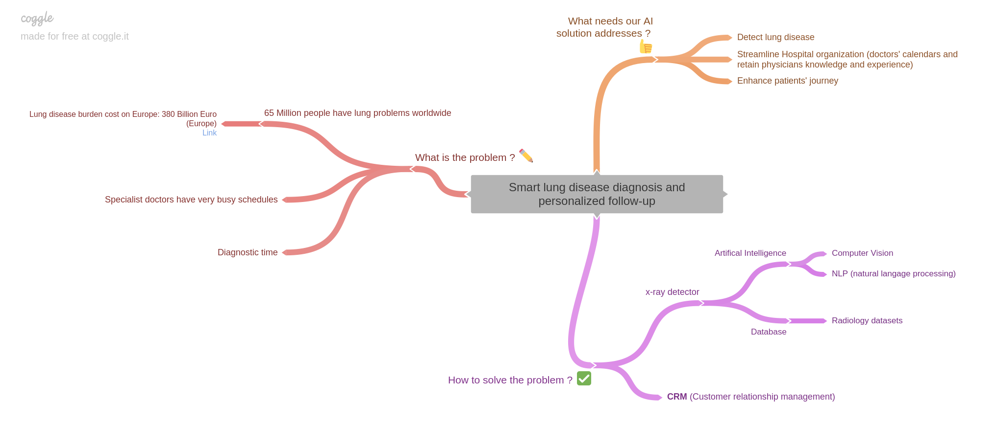
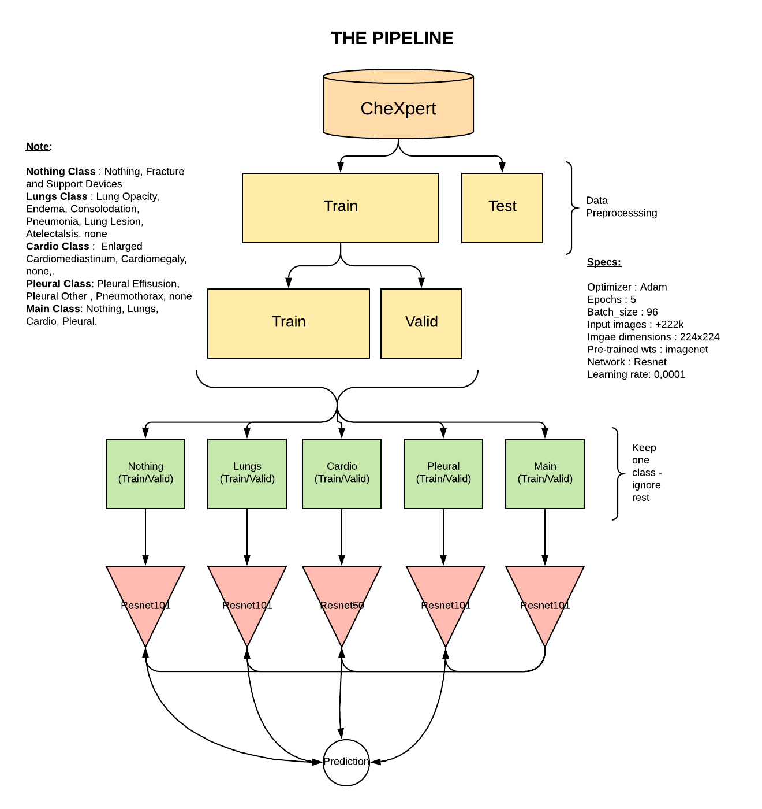
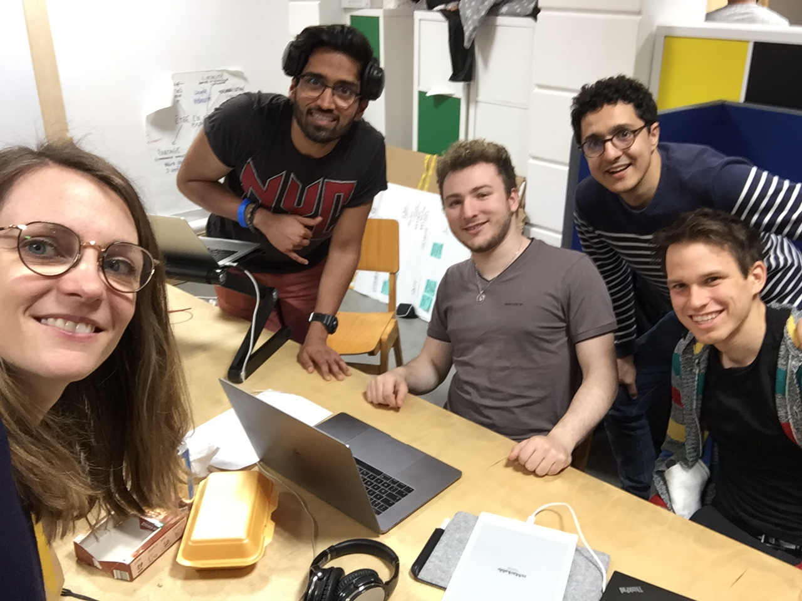

# Smart lung disease diagnosis and personalized follow-up

## Tagline

**AI² – Smart lung diagnosis and personalized follow-up**

## Summary

Our innovative solution aims to leverage AI (machine learning) on two streams (AIxAI=AI²), lung patient diagnostic, and hospital administrative workflow, to both streamline specialist workload and patient experience.

We are improving these processes by:
- using a prediction model based on lung X-rays, to determine a lung patient pathology
- automating coordination between diagnosis and booking assistant tools (CRM), to propose a relevant personalized follow-up appointment with a lung specialist

We also remove friction points in the process by using user-friendly app for the patient (e.g. to set reminders, localization of appointment, etc.)

## Link to the one page article

[Click here](one_page_article.md) for the more detailed approach

## Additional Resources

### XRay Analysis algorithm details

**Ressources**:
**CheXpert**: Irvin, Jeremy, Pranav Rajpurkar, Michael Ko, Yifan Yu, Silviana Ciurea-Ilcus, Chris Chute, Henrik Marklund, Behzad Haghgoo, Robyn Ball, und Katie Shpanskaya. „CheXpert: A Large Chest Radiograph Dataset with Uncertainty Labels and Expert Comparison“. arXiv preprint arXiv:1901.07031, 2019.

**ResNet**: He, Kaiming, Xiangyu Zhang, Shaoqing Ren, und Jian Sun. "Deep residual learning for image recognition". In Proceedings of the IEEE   conference on computer vision and pattern recognition, 770–778, 2016.

We tried the **VGG network**, but it didn´t perform as well: Simonyan, Karen, und Andrew Zisserman. "Very deep convolutional networks for large-scale image recognition." 
arXiv preprint arXiv:1409.1556, 2014.

## Technical Specifications

[Click here](technical_specifications.md) for the technical specifications

## Installations & Reproduction Detailed Instructions

[Click here](INSTALLATION.md) to access installation instructions

[Click here](REPRODUCIBILITY.md) to access reproducibility instructions

## Team Members

Benedikt Jordan [Linkedin](https://www.linkedin.com/in/benedikt-jordan-9b068b9a/), Benedikt.jordan@posteo.de

Anass Bellachehab [Linkedin](https://www.linkedin.com/in/anass-bellachehab-a89baa8a/), ans.bellache@gmail.com

Allwyn Joseph [Linkedin](https://www.linkedin.com/in/allwyn-joseph/), allwyn@azmed.com

Roman Sztergbaum [Linkedin](https://www.linkedin.com/in/roman-sztergbaum), [Github](https://github.com/Milerius), rmscastle@gmail.com

Noémie Héroin [Linkedin](https://www.linkedin.com/in/noemie-heroin), noemie.heroin@gmail.com
