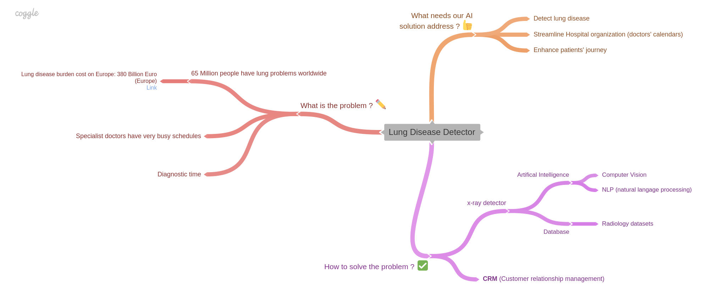

# Lung Disease Detector

## Tagline

AI – Faster lung diagnosis and personalized follow-up

**How to enable radiologists to focus on more value-added core responsibilities, while leveraging a smart connected hospital ?**

## Link to the one page article
[link](one_page_article.md)

## Additional Resources

### How our AI solution positively impacts the patient journey

#### `Current situation`

#### `With our solution: patient C gets an earlier appointment`

## Team Members

Benedikt Jordan [Linkedin](https://www.linkedin.com/in/benedikt-jordan-9b068b9a/) Benedikt.jordan@posteo.de

Anass Bellachehab [Linkedin](https://www.linkedin.com/in/anass-bellachehab-a89baa8a/) ans.bellache@gmail.com

Allwyn Joseph [Linkedin](https://www.linkedin.com/in/allwyn-joseph/), allwyn@azmed.com

Roman Sztergbaum [Linkedin](https://www.linkedin.com/in/roman-sztergbaum), [Github](https://github.com/Milerius) rmscastle@gmail.com

Noémie Héroin [Linkedin](www.linkedin.com/in/noemie-heroin) noemie.heroin@gmail.com
