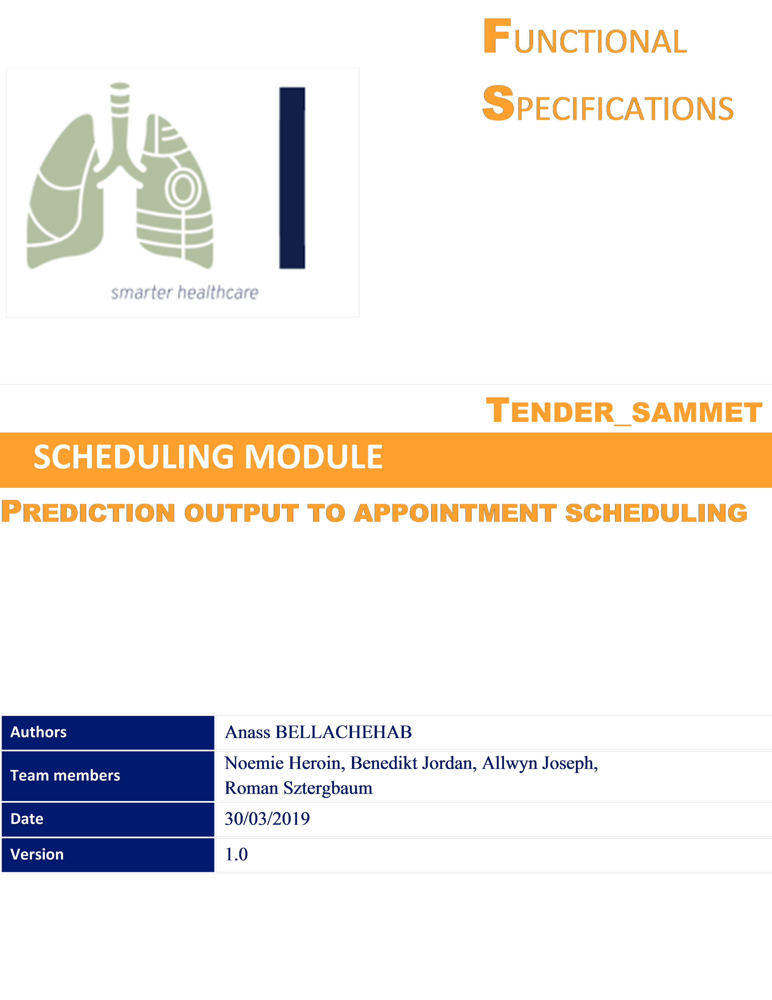
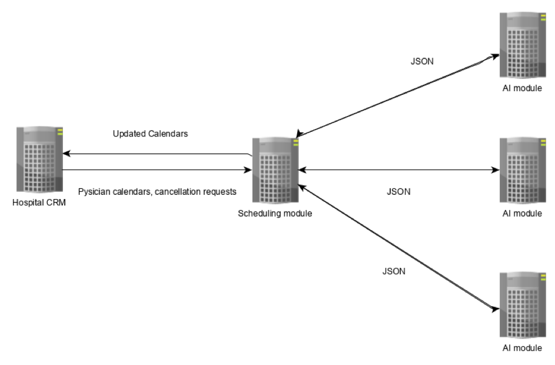

# 1. SYSTEM PRESENTATION

## 1.1 CONTEXT

This document presents the specification for the scheduling module that transforms prediction output from lung radio images, into an appointment with a lung specialist.

After disease detection and validation by a radiologist, a patient is given a priority score depending on the severity of his disease, as well as a recommended date range for a follow-up appointment. Here, the date range and priority score are parameters provided by medical professionals and are not deduced from machine learning. The process of assigning priority and date can eventually be partially automated as we will see in section 3, but a human in the loop is still preferred for this step.

After receiving his or her score, the result is sent to the Customer Relationship Management (**CRM**) of the patient’s hospital. Taking into account the necessary date range and priority of treatment he/she gets an appointment made with a doctor.

The advantage of this approach is that it prioritizes the most urgent cases and helps doctors manage their schedule efficiently.

## 1.2 SCHEDULING MODULE

The scheduling module acts as an interface between the hospital **CRM** and various instances (an instance per doctor) of the **AI** detections systems

The **AI** instances send their detection results to the scheduler in **JSON** format. Each **JSON** contains the following fields: